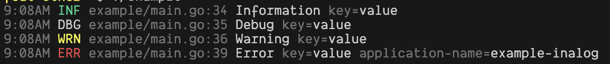

# INAlog - tint Integrations

logtint using github.com/lmittmann/tint package to
log with colored text.



## Usage

```go
import (
    ...

    "github.com/peruri-dev/inalog"
    "github.com/peruri-dev/inalog/integrations/logtint"
)

func main() {
    cfg := inalog.Cfg{
            Source:     true,
            CustomFunc: logtint.CreateTintHandler(),
            MessageKey: true,
        }

    inalog.Init(cfg)

    inalog.Log().Info("Hello world")
}
```
